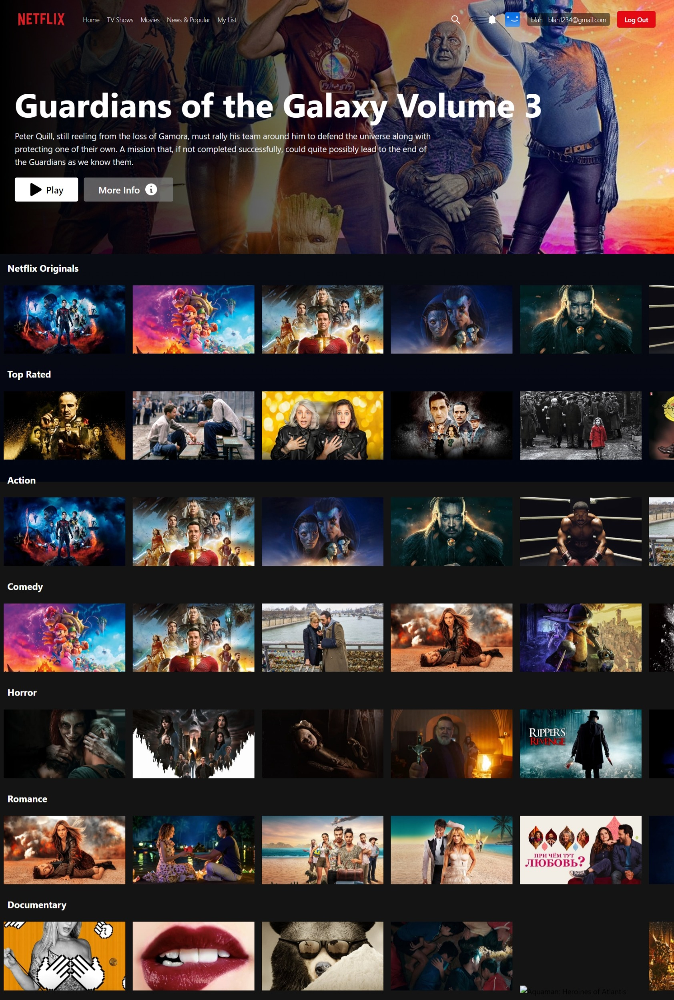

# Netflix clone ui

## Table of contents

- [Overview](#overview)
  - [Screenshot](#screenshot)
  - [Links](#links)
- [My process](#my-process)
  - [Built with](#built-with)
  - [Useful resources](#useful-resources)

## Overview

### Screenshot

### Links

- Solution URL: [Add solution URL here](https://your-solution-url.com)
- Live Site URL: [Add live site URL here](https://your-live-site-url.com)

## My process

### Built with

- [React](https://reactjs.org/)
- [TailwindCss](https://tailwindcss.com/) - For styles
- CSS custom properties
- Mobile-first workflow

### Useful resources

- [Tailwind scrollbar hide](https://www.npmjs.com/package/tailwind-scrollbar-hide) - This helped me to hide scrollbar in tailwindCss
- [How to hide your API keys and tokens in React to protect your application.](https://javascript.plainenglish.io/keep-your-application-secure-discover-how-to-hide-your-api-keys-and-tokens-in-react-364bb5a45372) - This is an amazing article which helped me how to hide your API keys or Url.

